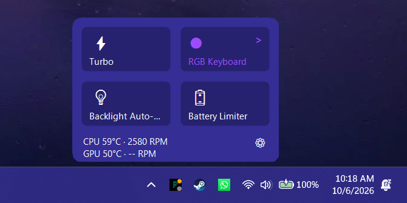
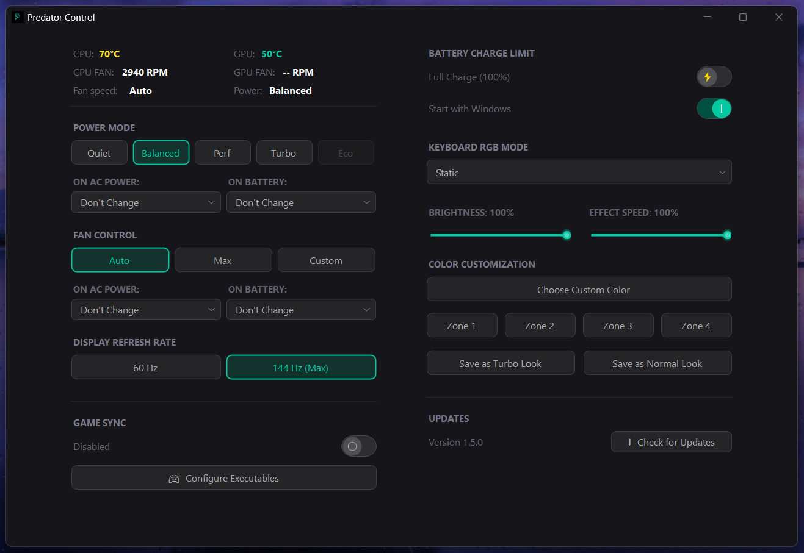

# Predator Control

A lightweight, open-source replacement for PredatorSense on Acer Predator laptops. It lives in the system tray and talks straight to Acer's WMI interface (part of Windows, not PredatorSense), so power modes, fans, display refresh rate, battery limit and keyboard lighting are a click away without the background services or the crashes.

This is an independent fork with a lot of added features, listed [below](#whats-new-in-this-fork).

  
   
  Left-click the tray icon for the Quick Settings flyout. It takes its color from your Windows accent color.

  
   
  The full dashboard: a normal resizable window with the native title bar.

---

## What's new in this fork

Added on top of the original project (v1.5.0):

- **Quick Settings flyout**: a Windows 11 style panel from the tray icon with Turbo, RGB, backlight and battery tiles plus live temperatures and fan speeds.
- **Follows your system colors**: the flyout picks up your Windows accent color automatically, so it matches your taskbar and Start menu.
- **Smarter tray icon**: left-click for the flyout, middle-click to toggle Turbo, right-click for the menu.
- **Tray badges and tooltip**: Turbo and GPU-awake badges, and a tooltip with temperatures, fan speeds and the process using the GPU.
- **Four-zone keyboard colors**: set each zone separately, with brightness, in the dashboard or the flyout.
- **Turbo and Normal looks**: save a lighting setup for each, and the keyboard switches with a short Wave or Zoom flourish when you toggle Turbo.
- **Lighting restored after sleep**: colors are re-applied after wake, unlock and startup.
- **Keyboard backlight auto-off**: switch the idle timeout on or off from the tray or the flyout.
- **Resizable window with snap**: native title bar, Aero Snap, snap layouts and maximize that respects the taskbar.
- **Adaptive layout**: two columns that fit the window, folding into one column when the window is narrow.
- **Background telemetry**: sensor and GPU-process polling runs off the UI thread, so the window stays smooth.

## Also included from the original project

- **Power modes**: Quiet, Balanced, Performance, Turbo and Eco.
- **Automatic profiles**: apply a power and fan mode when you plug in or unplug.
- **Fan control**: Auto, Max, or Custom with a fixed speed or a temperature curve.
- **Display refresh rate**: 60 Hz or the panel's maximum.
- **Battery charge limit**: 80% or 100%.
- **Keyboard effects**: Static, Breathing, Neon, Wave, Shifting, Zoom, Meteor and Twinkling.
- **Game Sync**: per-game power, fan, refresh rate, battery and lighting settings, restored when the game exits.
- **Start with Windows**: starts hidden in the tray, with no UAC prompt at login.
- **In-app updates** from GitHub Releases.

---

## Requirements

- An Acer Predator laptop that exposes the `AcerGamingFunction` WMI class
- Windows 10 or 11
- Administrator rights (the app asks for them on launch)
- The **.NET 10 Desktop Runtime**, unless you use the standalone build

> **Compatibility:** this fork is developed and tested on a **Predator PH315-52 (Helios 300)**. The project it descends from was tested on a Helios Neo 16. Other Predator models may work, partly work, or not work, and some features depend on what your firmware exposes. See the disclaimer below.

## Install

Download the latest `.exe` from the [Releases](../../releases) page and run it as administrator. Releases include a standalone build (nothing else to install) and a smaller build that needs the .NET 10 Desktop Runtime. The in-app updater picks the matching one for you.

Starting the app with `-hidden` keeps it in the tray without opening the dashboard. The Start with Windows switch sets this up for you.

## Replacing PredatorSense

Because the app uses Acer's WMI driver directly, you can switch PredatorSense and its background services off. Keep it installed until you're happy with Predator Control.

1. **Disable the services.** Open `services.msc` and set these to **Disabled** (stop them if running): `Acer Gaming Service`, `Acer Quick Access Service`, `AcerService`, `Acer Power Button Service`. The WMI driver that actually controls the hardware is separate and stays active.
2. **Remove PredatorSense from startup.** In Task Manager's **Startup apps** tab, disable PredatorSense and other Acer entries. For a thorough job, also delete Acer-related entries under `HKCU\SOFTWARE\Microsoft\Windows\CurrentVersion\Run` and the same key under `HKLM`.
3. **Turn on Start with Windows** in Predator Control's dashboard.
4. **Uninstall PredatorSense** (optional) from Settings, Apps, Installed apps.

## Building from source

1. Install the [.NET 10 SDK](https://dotnet.microsoft.com/download/dotnet/10.0)
2. Clone this repo
3. Open `PredatorControlApp.slnx` in Visual Studio, or run `dotnet build` in the repo root

The project is a WinForms app (`PredatorControlApp/PredatorControlApp.csproj`) that requests administrator rights through its manifest.

## How it works

Hardware control goes through two WMI classes in the `root\WMI` namespace:

- `AcerGamingFunction` handles power modes, fan behavior and speeds, sensors, keyboard lighting and refresh-rate related settings.
- `APGeAction` handles the keyboard backlight timeout.
- `BatteryControl` handles the charge limit.

Several behaviors (zone bitmasks, the fan-behavior encoding, how the backlight class is located) were worked out by experiment. They are documented in comments in `PredatorControlApp/WmiController.cs`. The commit history is deliberately detailed and is the best record of what was found and why.

## Where your data lives

- Settings: `HKEY_CURRENT_USER\SOFTWARE\PredatorControl`
- Game Sync profiles and the error log (`crash.log`): `%LOCALAPPDATA%\PredatorControl`

## Credits

This project descends from [Paulrod20/p-helper](https://github.com/Paulrod20/p-helper) through [supesonly/Acer-P-Helper](https://github.com/supesonly/Acer-P-Helper), which supplied the WMI groundwork, the dashboard controls, Game Sync, the fan curve and the updater. Thanks to both for the foundation. Finding the backlight WMI class was guided by the GUIDs used in the Linux [Linuwu-Sense](https://github.com/0x7375646F/Linuwu-Sense) driver.

## Disclaimer

> **This software was built with the help of AI tools** and has only been tested on one laptop. It changes fan, power and firmware-level settings, so **use it at your own risk**. It is provided without warranty of any kind, and you are responsible for anything that happens as a result of using it. If something misbehaves, restore the defaults from PredatorSense or reinstall it.

## License

[MIT](LICENSE). Free to use, modify and share. It is a free community tool, so if someone charged you for it, you were overcharged.
